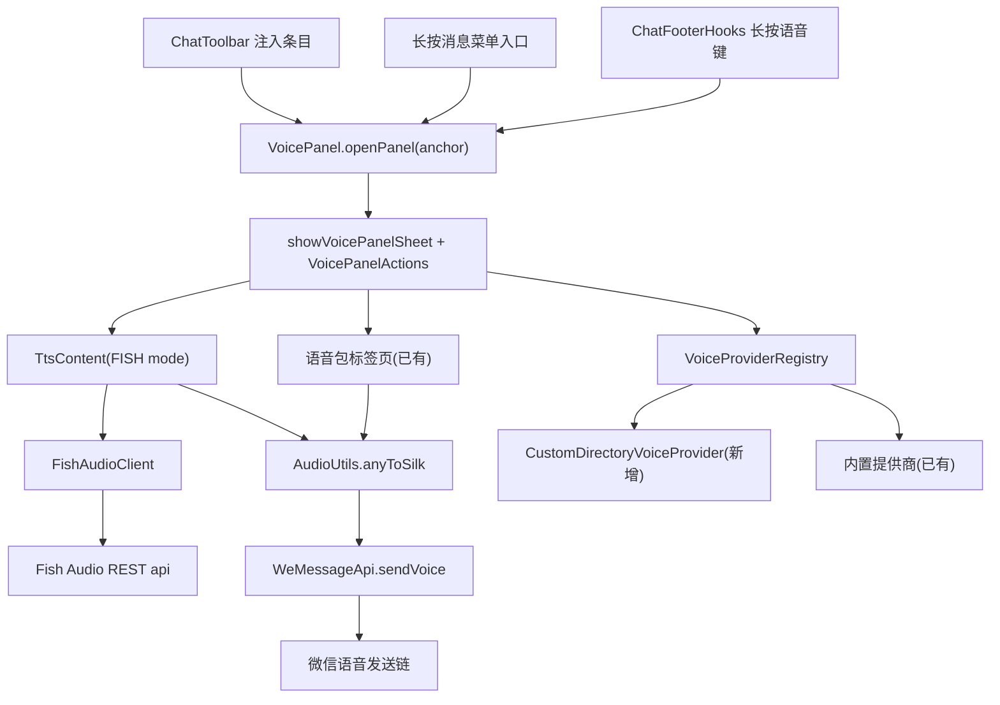

# 语音消息（Voice Messages）技术设计

Feature Name: voice-messages
Updated: 2026-08-30

## Description

WeKit 为微信聊天提供语音消息能力：在聊天页通过长按消息菜单或聊天工具栏打开语音面板，支持 Fish Audio 文字转语音（TTS）、语音包管理与发送、自定义在线语音目录下载，并以微信原生语音消息发送到当前会话。

调研结论：WeKit 上游 dev 分支已合并一套完整的语音面板基础设施（`VoicePanel` + `VoicePanelSheet` + `VoicePanelActions`），覆盖语音包管理、试听、发送、Edge TTS、系统 TTS、声音克隆、在线提供商（FunBox/铃声多多/千变语音2）。本设计采用**增量扩展**策略：复用现有面板与发送链，新增缺失的 Fish Audio TTS、自定义在线目录源、ChatToolbar/长按消息菜单入口与独立配置。

## Architecture



## Components and Interfaces

### 1. 入口（新增）

#### 1.1 ChatToolbar 注入条目
修改 `app/src/main/java/dev/ujhhgtg/wekit/features/items/chat/ChatToolbar.kt`：

- 新增 `private const val VOICE_MESSAGE_NAME = "语音消息"`（与 `QUICK_REPLY_NAME`/`WEAGENT_NAME` 同级，位于 `NAME_TO_ICON_MAP` 之外）。
- `iconFor(name)` 增加分支：`VOICE_MESSAGE_NAME -> MaterialSymbols.Outlined.Volume_up`（`com.composables.icons.materialsymbols.outlined.Volume_up`）。
- `labelResFor(name)` 增加分支，指向新增资源 `R.string.chat_toolbar_voice_message`。
- `supportedItems`（约 line 345）加入 `VOICE_MESSAGE_NAME`；`normalizeOrder` 内为其补位逻辑（参照 `WEAGENT_NAME`）。
- `sortedVisibleItems` 构建 `list` 处新增：
  ```kotlin
  list.add(VOICE_MESSAGE_NAME to {
      VoicePanel.openPanel(activity)
  })
  ```
- `VoicePanel.openPanel` 增加 `Context` 重载（现有 `openPanel(anchor: View)` 委托之），`showVoicePanelSheet` 仅需 context。

#### 1.2 长按消息菜单入口
新增 `app/src/main/java/dev/ujhhgtg/wekit/features/items/chat/VoiceMessageMenu.kt`：

- `object VoiceMessageMenu : SwitchFeature(), WeChatMessageContextMenuApi.IMenuItemsProvider`（参照 `AiReply.kt` 模式）。
- `onEnable`/`onDisable` 注册/移除 provider。
- `getMenuItems()` 返回 `MenuItem(id, text = "语音消息", imageVector = MaterialSymbols.Outlined.Volume_up, isSupported = 任意消息均支持) { view, _, _ -> VoicePanel.openPanel(view) }`。
- 开关独立成 feature（technicalId = "语音消息菜单"），与语音面板主开关解耦。

#### 1.3 现有入口
`ChatFooterHooks.kt`（长按聊天输入栏语音键）保持不变，三者共存。

### 2. Fish Audio TTS（新增）

#### 2.1 FishAudioClient
新增 `app/src/main/java/dev/ujhhgtg/wekit/utils/FishAudioClient.kt`，采用 OkHttp 模式（参照 `VoiceProviders.kt` 的 `getText`/`awaitResponse`）。

- 接口：`suspend fun synthesize(text: String, referenceId: String?, apiKey: String): Result<File>`。
- 请求：`POST https://api.fish.audio/v1/tts`，Header `Authorization: Bearer $apiKey`、`model: s2.1-pro-free`，Body JSON `{ "text": ..., "reference_id": ..., "format": "mp3", "chunk_length": 300, "normalize": true }`。
- 响应为 mp3 二进制流，写入 `PanelPaths.panelCacheDir` 临时文件，返回 `File`。
- 时长通过 `AudioUtils.getDurationMs` 读取。
- 错误分类：HTTP 4xx（Key 无效/限额）、5xx（服务端）、网络异常；将状态码与响应体写入 `WeLogger`。

#### 2.2 TtsMode 扩展
`app/src/main/java/dev/ujhhgtg/wekit/ui/panel/VoicePanelTtsContent.kt`：

- `TtsMode` 增加 `FISH`。
- `TtsContent` 增加 FISH 分支：音色单选列表（显示名 + reference_id）+ 「管理音色」按钮；转换/发送按钮逻辑与现有 mode 一致。
- `VoicePanelSheet.kt` 的 TTS 分发处（约 line 1449）增加 `TtsMode.FISH -> actions.synthesizeFish(ttsText, selectedFishVoiceId)`。

#### 2.3 VoicePanelActions 扩展
`app/src/main/java/dev/ujhhgtg/wekit/ui/panel/VoicePanelSheet.kt` 的 `data class VoicePanelActions` 增加：

```kotlin
val loadFishVoices: suspend () -> Result<List<FishVoice>> = { Result.failure(UnsupportedOperationException()) },
val synthesizeFish: suspend (String, String?) -> Result<Unit> = { _, _ -> Result.failure(UnsupportedOperationException()) },
val saveFishVoice: suspend (name: String, referenceId: String) -> Result<Unit> = { _, _ -> Result.failure(UnsupportedOperationException()) },
val deleteFishVoice: suspend (referenceId: String) -> Result<Unit> = { Result.failure(UnsupportedOperationException()) },
```

`FishVoice(name: String, referenceId: String)` 数据类新增于 `ui/panel/VoicePanelSheet.kt` 或独立文件。`VoicePanel.kt` 的 `buildActions` 实现这些回调（读写 MMKV，见 Data Models）。

### 3. 自定义在线语音目录（新增）

新增 `app/src/main/java/dev/ujhhgtg/wekit/features/items/chat/panel/voice/CustomDirectoryVoiceProvider.kt`：

- `object CustomDirectoryVoiceProvider : VoiceProvider`（实现 `VoiceProviders.kt` 的 `VoiceProvider` 接口）。
- `id = "custom_directory"`、`name = "自定义目录"`。
- `browse(parent = null)`：读取 MMKV `voice_directory_url`，`GET` 该 URL，解析 JSON（schema 见 Data Models），返回 `VoiceItem` 列表（`source = PanelSource.ONLINE`，`remoteUrl` 为音频地址，`format` 由扩展名推断）。`parent != null` 视为无效。
- `search` 返回空结果（不支持搜索）。
- `resolveAudio(item)` 直接返回 `item`（remoteUrl 已在目录 JSON 中）。
- 加入 `VoiceProviderRegistry.providers`（`VoiceProviders.kt`），`forItem` 增加 `item.id.startsWith("custom:")` 分支。
- URL 未配置时 `browse` 返回 `Result.failure`，提示「请先在配置中填写目录源 URL」。

### 4. 独立配置（新增）

在语音面板标题栏增加齿轮入口（`VoicePanelSheet.kt` 标题行），点击打开配置对话框（参照 `AiReply.kt` 的 `ModelConfigPanel` 模式：二级 `showComposeDialog`）：

- **Fish Audio 配置**：API Key 输入（密码框）、音色条目 CRUD（名称 + reference_id）、连接测试按钮。
- **在线目录配置**：目录源 URL 输入。
- 保存写入 MMKV `voice_fish_*` / `voice_directory_url` 键（见 Data Models），保存后立即生效（面板状态保持）。

### 5. 复用组件（不改动）

- **语音包管理**（R4）：`VoicePanelRepository`、导入/排序/重命名/删除。
- **语音发送**（R6）：`WeMessageApi.sendVoice`（Service 发送链 + WAuxv fallback）+ `AudioUtils.anyToSilk`。
- **播放管理**（R8）：`VoicePreview`（单实例播放器，面板关闭释放）。
- **本地克隆**（R3 已有部分）：`CloneVoiceRepository`。

## Data Models

### MMKV 配置键（`voice_*` 前缀，独立于 AiReply/WeAgent）

| Key | 类型 | 说明 |
|---|---|---|
| `voice_fish_api_key` | String | Fish Audio API Key |
| `voice_fish_voices` | JSON String | 音色列表：`[{"name":"温柔女声","referenceId":"xxxx"}]` |
| `voice_fish_selected_id` | String | 当前选中音色 reference_id |
| `voice_directory_url` | String | 自定义在线目录源 URL |

通过 `WePrefs.prefOption` delegate 声明（参照 `AiReply.ModelConfig` 的 `WePrefs.prefOption` 用法）。

### 自定义在线目录 JSON Schema

```json
{
  "items": [
    {
      "name": "语音标题",
      "url": "https://example.com/voice1.mp3",
      "format": "mp3"
    }
  ]
}
```

- `format` 可选，缺省时由 `url` 扩展名推断（`mimeExtension` 逻辑）。
- 解析失败返回 `Result.failure`，保留面板中已缓存的条目。

## Correctness Properties

- 任一时刻仅一段音频播放（复用 `VoicePreview` 单实例约束）。
- Fish Audio 请求未配置 API Key 时不发起网络请求，直接提示配置。
- TTS 生成产物（mp3/silk 临时文件）在使用后删除；`DisposableEffect` 清理。
- `sendVoice` 的 `durationMs` 钳制在 `1..60_000`（现有实现保证）。
- ChatToolbar 注入条目在语音面板功能关闭时不可见（`enabledItems` 过滤逻辑复用）。
- 语音消息菜单入口与语音面板开关相互独立，但都要求 VoicePanel 打开路径可达。

## Error Handling

| 场景 | 处理 |
|---|---|
| Fish Audio Key 无效（401/403） | 面板内显示错误信息 + 打开配置对话框 |
| Fish Audio 服务端错误（5xx） | 显示错误码与消息，保留输入文字与音色 |
| 网络中断/超时 | 显示网络错误，保留状态 |
| 目录源 URL 未配置 | 提示进入配置填写 URL |
| 目录 JSON 格式无效 | 显示解析失败原因，保留已缓存条目 |
| 音频解码/SILK 编码失败 | `AudioUtils.anyToSilk` 返回 false → 显示失败提示 |
| 发送链调用失败 | `WeMessageApi.sendVoice` 返回 false → 显示失败提示 |

## Test Strategy

- 网络与 TTS 行为依赖真实 Fish Audio 账号与微信宿主，无法在桌面 JVM 测试，遵循 AGENTS.md 测试策略：以真机手工验证为主。
- 新增 DexKit 解析：本项目无新增 dex 目标（发送链复用 `WeMessageApi.sendVoice` 既有解析），无需 `./x dex-test` 变更；若实现阶段发现需调整，按 AGENTS.md 规则执行。
- 提交前执行 `./x build` 与 `git diff --check`。
- 手工验证清单：ChatToolbar 注入条目可见性/排序/开关联动；长按消息菜单项；Fish Audio 生成→试听→保存→发送；自定义目录加载与下载；面板关闭后播放器释放。

## References

- 现有实现：`app/src/main/java/dev/ujhhgtg/wekit/features/items/chat/VoicePanel.kt`、`ui/panel/VoicePanelSheet.kt`、`ui/panel/VoicePanelTtsContent.kt`、`features/items/chat/panel/voice/VoiceProviders.kt`、`features/api/core/WeMessageApi.kt`（`sendVoice`）、`utils/AudioUtils.kt`。
- 入口参考：`features/items/chat/AiReply.kt`（长按菜单）、`features/items/chat/ChatToolbar.kt`（工具栏注入）。
- Fish Audio REST：`https://api.fish.audio/v1/tts`（Bearer 认证，`model: s2.1-pro-free`）。
